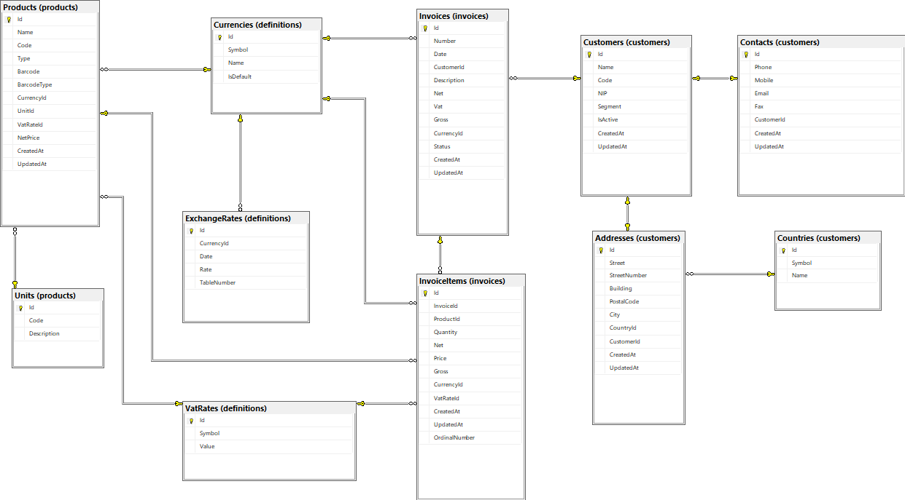

# InvoicePI
Sample .NET Core WinForms application implemented with basic [CQRS](https://docs.microsoft.com/en-us/azure/architecture/guide/architecture-styles/cqrs) approach and [MVP (Model-View-Presenter) Passive-View](https://martinfowler.com/eaaDev/PassiveScreen.html) pattern.

## Description
At the beginning, the program asks you to provide the database server on which it will work and the credentials with which it will be able to authenticate.
The program will then create the required structure in the database for its later work and will automatically generate the number provided by the user objects.
The program allows you to view, create, modify and export data about customers, products and invoices.
The program also allows you to export data to XML, CSV, XLSX and TXT formats.

## Architecture [Clean Architecture](https://jasontaylor.dev/clean-architecture-getting-started/)

## CQRS

Read Model/Write Model - implementing the [Repository and Unit of Work](https://learn.microsoft.com/en-us/aspnet/mvc/overview/older-versions/getting-started-with-ef-5-using-mvc-4/implementing-the-repository-and-unit-of-work-patterns-in-an-asp-net-mvc-application) patterns (using Entity Framework Core).

Commands/Queries handling using [MediatR](https://github.com/jbogard/MediatR) library.

## Database Diagram

## User Interface

Desktop application using [DevExpress WinForms UI Controls](https://www.devexpress.com/products/net/controls/winforms/) v23.1 

## Validation

Data validation using [FluentValidation](https://github.com/JeremySkinner/FluentValidation)

## Data Export

CSV using [CsvHelper](https://joshclose.github.io/CsvHelper/).
XLSX using [OfficeOpenXml](https://epplussoftware.com/docs/5.8/api/OfficeOpenXml.html).
XML using [XmlSerializer](https://learn.microsoft.com/pl-pl/dotnet/api/system.xml.serialization.xmlserializer?view=net-7.0). 
TXT using [StreamWriter](https://learn.microsoft.com/pl-pl/dotnet/api/system.io.streamwriter?view=net-7.0).

## How to run application
1. Run from Visual Studio or using a file with the .exe extension.
2. Set connection settings to the database server.
2. Optionally generate sample data.
3. Run!
