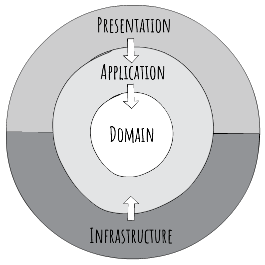

# InvoicePI
Sample .NET WinForms application implemented with basic [CQRS](https://docs.microsoft.com/en-us/azure/architecture/guide/architecture-styles/cqrs) approach and [MVP (Model-View-Presenter) Passive-View](https://martinfowler.com/eaaDev/PassiveScreen.html) pattern.

## Description
Initially, the program prompts you to input the database server where it will operate and the authentication credentials for verification. 
Subsequently, it proceeds to set up the essential database structure needed for its subsequent operations and automatically generates objects based on the user's specified quantity.
The program boasts a wide range of features, allowing you to view, create, edit, and menage customer, product, and invoice data. 
Furthermore, it provides the capability to export data in formats such as XML and CSV, and it also provides the capability to generate reports in PDF format.

## Architecture [Clean Architecture](https://jasontaylor.dev/clean-architecture-getting-started/)

## CQRS

Read Model/Write Model implementing the [Repository and Unit of Work](https://learn.microsoft.com/en-us/aspnet/mvc/overview/older-versions/getting-started-with-ef-5-using-mvc-4/implementing-the-repository-and-unit-of-work-patterns-in-an-asp-net-mvc-application) patterns (using Entity Framework Core). Commands/Queries handling using [MediatR](https://github.com/jbogard/MediatR) library.

## Database Diagram

## User Interface

Desktop application using [DevExpress WinForms UI Controls](https://www.devexpress.com/products/net/controls/winforms/) v23.1.

## Validation

Data validation using [FluentValidation](https://github.com/JeremySkinner/FluentValidation).

## Export

Data export (list) to two formats:
XML using [XmlSerializer](https://learn.microsoft.com/pl-pl/dotnet/api/system.xml.serialization.xmlserializer?view=net-7.0) and CSV using [CsvHelper](https://joshclose.github.io/CsvHelper/).

## Data Generation

Sample data generation using [Bogus](https://github.com/bchavez/Bogus).

## Reports

Generate raports using [HiQPdf](https://www.hiqpdf.com). The Free version allows to create small PDF documents with up to 3 PDF pages. 

## How to configure and run application
1. Run app from Visual Studio or .NET CLI (dotnet build, dotnet run).
2. Set connection settings to the database server.
2. Optionally generate sample data.
3. Get started with the program!
